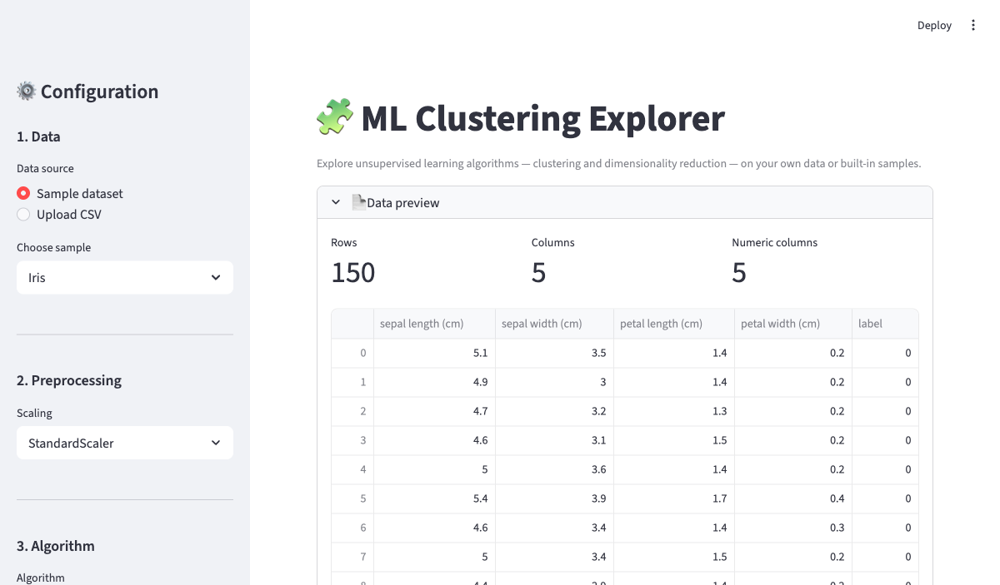

<div align="center">

# ML Clustering Explorer

[](https://www.python.org/)
[](https://streamlit.io/)
[](https://scikit-learn.org/)
[](https://plotly.com/python/)
[](https://docs.astral.sh/uv/)
[](https://opensource.org/licenses/MIT)

**An interactive web app for exploring popular unsupervised learning algorithms — clustering and dimensionality reduction — on your own data or built-in samples.**

[🚀 Live Demo](https://mlclustering-888.streamlit.app/) · [Report Bug](https://github.com/alfredang/mlclustering/issues) · [Request Feature](https://github.com/alfredang/mlclustering/issues)

</div>

## Screenshot



## About

ML Clustering Explorer is a Streamlit-based playground that lets students, analysts, and ML practitioners experiment with unsupervised algorithms without writing any code. Upload a CSV or pick a sample dataset, choose an algorithm, tune the hyperparameters, and instantly see clusters, validation metrics, and 2D/3D projections.

### Key Features

| Feature | Description |
|---------|-------------|
| 📂 **Bring your own data** | Upload a CSV or use built-in samples (Iris, Wine, Blobs, Moons, Circles) |
| 🧮 **9 clustering algorithms** | K-Means, Mini-Batch K-Means, Gaussian Mixture (EM), DBSCAN, OPTICS, Agglomerative, Spectral, Mean Shift, BIRCH |
| 📉 **4 dimensionality reduction methods** | PCA, ICA, Truncated SVD, t-SNE |
| ⚙️ **Live hyperparameter tuning** | Sliders/selectboxes for every algorithm — results update instantly |
| 📊 **Internal validation metrics** | Silhouette, Calinski-Harabasz, Davies-Bouldin, plus algorithm-specific (inertia, AIC/BIC, log-likelihood, explained variance) |
| 📈 **Elbow & silhouette analysis** | Auto-generated for K-Means to help pick the optimal k |
| 🎨 **Interactive Plotly visualizations** | 2D scatter, 3D projection, cluster size distribution |
| ⬇️ **Export labeled data** | Download a CSV with cluster labels appended |

## Tech Stack

| Category | Technology |
|----------|------------|
| **Frontend / UI** | Streamlit |
| **ML Algorithms** | scikit-learn (cluster, mixture, decomposition, manifold) |
| **Data** | pandas, NumPy, SciPy |
| **Visualization** | Plotly, Matplotlib, Seaborn |
| **Package management** | uv |
| **Language** | Python 3.10+ |

## Architecture

```
┌──────────────────────────────────────────────────────────┐
│                    Streamlit Web UI                      │
│  ┌────────────┐  ┌────────────┐  ┌──────────────────┐    │
│  │  Sidebar   │  │  Main      │  │  Plotly Charts   │    │
│  │  Controls  │  │  Results   │  │  (2D / 3D)       │    │
│  └────────────┘  └────────────┘  └──────────────────┘    │
└──────────────────────┬───────────────────────────────────┘
                       │
        ┌──────────────┴──────────────┐
        │                             │
        ▼                             ▼
┌──────────────────┐         ┌──────────────────────┐
│  Preprocessing   │         │  Clustering / DR     │
│  (StandardScaler │ ──────▶ │  (sklearn estimators)│
│   MinMaxScaler)  │         │                      │
└──────────────────┘         └──────────┬───────────┘
                                        │
                                        ▼
                             ┌──────────────────────┐
                             │  Metrics & Export    │
                             │  Silhouette / CH /   │
                             │  DB / AIC / BIC      │
                             └──────────────────────┘
```

## Project Structure

```
mlclustering/
├── app.py              # Streamlit application (entry point)
├── pyproject.toml      # Project metadata & dependencies (uv)
├── uv.lock             # Locked dependency versions
├── screenshot.png      # App preview
└── README.md
```

## Getting Started

### Prerequisites
- Python 3.10 or higher
- [uv](https://docs.astral.sh/uv/getting-started/installation/) package manager

### Installation

```bash
# Clone
git clone https://github.com/alfredang/mlclustering.git
cd mlclustering

# Install dependencies (uv creates the venv automatically)
uv sync
```

### Run

```bash
uv run streamlit run app.py
```

The app opens at `http://localhost:8501` by default. To use a different port:

```bash
uv run streamlit run app.py --server.port 60531
```

## Usage

1. **Pick data** — Choose a sample dataset or upload your own CSV (numeric columns only are used for clustering).
2. **Preprocess** — Select a scaler (StandardScaler is recommended for distance-based algorithms).
3. **Choose an algorithm** — Tune the hyperparameters with the live sliders.
4. **Inspect results** — Review the cluster scatter plot, size distribution, and validation metrics.
5. **Download** — Export the original dataset with a `cluster` column appended.

## Deployment

### Streamlit Community Cloud
1. Push this repository to GitHub.
2. Visit [share.streamlit.io](https://share.streamlit.io) and connect the repo.
3. Set the main file to `app.py` and deploy.

### Docker

```dockerfile
FROM python:3.11-slim
WORKDIR /app
COPY . .
RUN pip install uv && uv sync --frozen
EXPOSE 8501
CMD ["uv", "run", "streamlit", "run", "app.py", "--server.port=8501", "--server.address=0.0.0.0"]
```

```bash
docker build -t mlclustering .
docker run -p 8501:8501 mlclustering
```

## Contributing

1. Fork the repository
2. Create a feature branch (`git checkout -b feature/my-feature`)
3. Commit your changes (`git commit -m 'Add my feature'`)
4. Push to the branch (`git push origin feature/my-feature`)
5. Open a Pull Request

## Developed By

**[Tertiary Infotech Academy Pte. Ltd.](https://www.tertiarycourses.com.sg/)**

Providing hands-on training in AI, machine learning, and data science.

## Acknowledgements

- [scikit-learn](https://scikit-learn.org/) — the workhorse for all clustering and dimensionality reduction
- [Streamlit](https://streamlit.io/) — for the delightful web framework
- [Plotly](https://plotly.com/python/) — for interactive visualizations
- [uv](https://docs.astral.sh/uv/) — fast Python package management

## License

Distributed under the MIT License.

---

⭐ If this project helped you, please consider giving it a star on GitHub!
